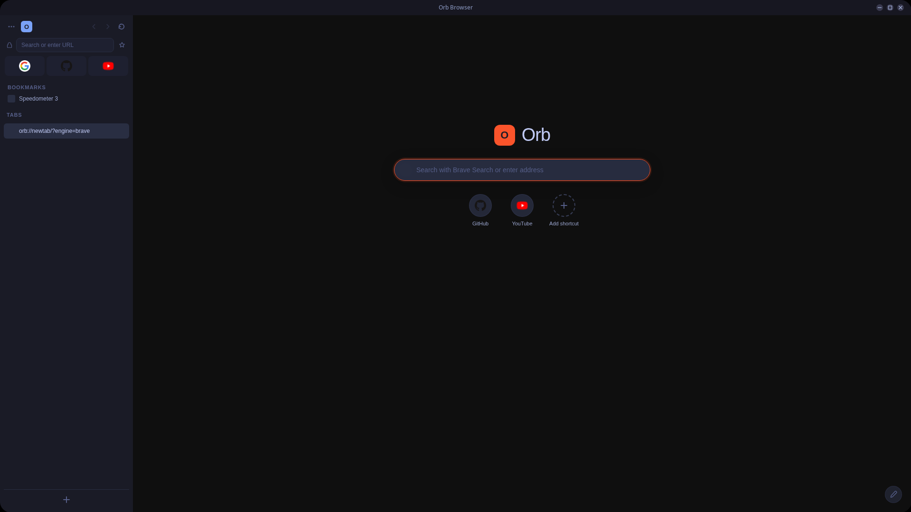

# Orb Browser

A lightweight, CEF-based web browser for Linux with off-screen rendering, a vertical sidebar UI, and built-in ad blocking.



## Features

- **Off-Screen Rendering (OSR)** -- All rendering composited through Cairo, no native CEF windows
- **Vertical sidebar** -- Tab list, bookmarks, downloads, navigation controls in a collapsible sidebar
- **Custom titlebar** -- Frameless window with minimize/maximize/close buttons
- **Ad blocker** -- EasyList + EasyPrivacy filter lists built in
- **New tab page** -- Search bar, shortcut grid, customizable backgrounds (solid/gradient/upload)
- **Tab management** -- Multiple tabs, incognito tabs, drag-to-reorder, Ctrl+Tab/Ctrl+W/Ctrl+T
- **Per-domain zoom** -- Zoom levels saved and restored per domain
- **Session restore** -- Tabs restored on restart
- **Find in page** -- Ctrl+F search with match count
- **Bookmarks** -- Add/remove with Ctrl+D, sidebar list
- **History and Downloads pages** -- `orb://history/` and `orb://downloads/`
- **Context menu** -- Right-click with open in new tab, copy link, inspect element
- **Keyboard shortcuts** -- Ctrl+L (address bar), Ctrl+S (toggle sidebar), Ctrl+1-9 (switch tabs), F11 (fullscreen), F12 (DevTools)

## Dependencies

- CMake 3.19+
- GCC/G++ with C++20 support
- GTK 3
- CEF (Chromium Embedded Framework) binary distribution

### Install build dependencies (Arch Linux)

```
sudo pacman -S cmake gcc gtk3 pkgconf curl
```

### Install build dependencies (Ubuntu/Debian)

```
sudo apt install cmake g++ libgtk-3-dev pkg-config curl
```

## Building

1. Download CEF binary distribution:

```
# Download from https://cef-builds.spotifycdn.com/index.html
# Select: Linux 64-bit -> Standard Distribution
wget 'https://cef-builds.spotifycdn.com/cef_binary_<VERSION>_linux64.tar.bz2'
tar xf cef_binary_*_linux64.tar.bz2
mv cef_binary_*_linux64 third_party/cef
```

2. Build:

```
./build.sh
```

Or manually:

```
mkdir -p build && cd build
cmake .. -DCMAKE_BUILD_TYPE=Release
make -j$(nproc)
```

3. Run:

```
cd build && ./zen-browser
```

## Benchmarks

Tested on Linux x86_64 with NVIDIA GeForce RTX 4070 Laptop GPU. Same machine, same conditions.

| Benchmark | Orb Browser | Ungoogled Chromium | Notes |
|:----------|:------------|:-------------------|:------|
| Speedometer 3.0 | 20.4 | 22.0 | JS/DOM performance |
| MotionMark 1.2 | 720.98 | 707.97 | Graphics/rendering |

Orb Browser uses CEF with off-screen rendering (OSR), single-process mode, and a minimal UI layer. The simplified rendering pipeline and lack of multi-process IPC overhead result in competitive graphics performance despite the OSR compositing cost.

## Project Structure

```
src/
  main.cc                  -- Entry point
  browser/
    browser_app.cc         -- CEF app setup, scheme registration
    browser_client.cc      -- CEF client handlers (display, keyboard, download, etc.)
    browser_window.cc      -- GTK window, OSR compositing, input routing
    tab_manager.cc         -- Tab state management
    scheme_handler.cc      -- orb:// scheme (newtab, history, downloads)
    query_handler.cc       -- JS-to-C++ command bridge (cefQuery)
  blocker/
    filter_rules.cc        -- EasyList/EasyPrivacy parser
    request_filter.cc      -- Request interception
  ui/
    index.html             -- Sidebar chrome UI
    app.js                 -- Sidebar logic
    style.css              -- Sidebar styles
resources/
  easylist.txt             -- Ad block filter list
  easyprivacy.txt          -- Privacy filter list
```

## Roadmap

### Done

- [x] CEF off-screen rendering with Cairo compositing
- [x] Vertical sidebar (tab list, navigation, bookmarks)
- [x] Collapsible sidebar (Ctrl+S pin/unpin, hover to show)
- [x] Custom frameless titlebar with minimize/maximize/close
- [x] Tab management (open, close, switch, drag reorder)
- [x] Incognito tabs
- [x] New tab page with search bar and shortcut grid
- [x] Customizable backgrounds (solid/gradient/image upload)
- [x] Built-in ad blocker (EasyList + EasyPrivacy)
- [x] Per-domain zoom persistence
- [x] Session restore
- [x] Find in page (Ctrl+F)
- [x] Bookmarks (Ctrl+D)
- [x] History page (orb://history/)
- [x] Downloads page (orb://downloads/)
- [x] URL autocomplete from history/bookmarks
- [x] Context menu (open in new tab, copy link, inspect)
- [x] Keyboard shortcuts (Ctrl+T/W/L/Tab, F11, F12)
- [x] Configurable search engine (Google, DuckDuckGo, Bing, Brave)
- [x] Configurable download directory
- [x] Wayland support

### Planned

- [ ] Windows support
- [ ] Extension support
- [ ] Sync (bookmarks, history, settings)
- [ ] Multiple profiles
- [ ] Reader mode
- [ ] Picture-in-picture
- [ ] Tab groups
- [ ] Custom themes/CSS
- [ ] Autofill (forms, passwords)
- [ ] Translation
- [ ] PDF viewer
- [ ] Print to PDF
- [ ] Notification support
- [ ] Hardware video acceleration

## License

MIT
